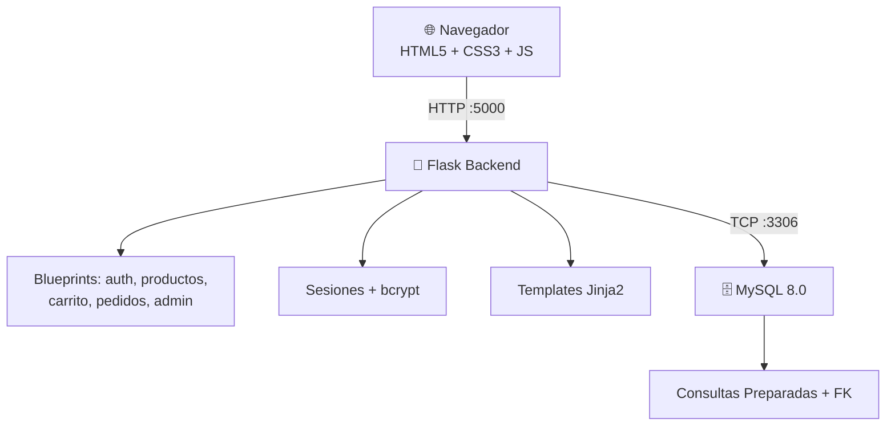
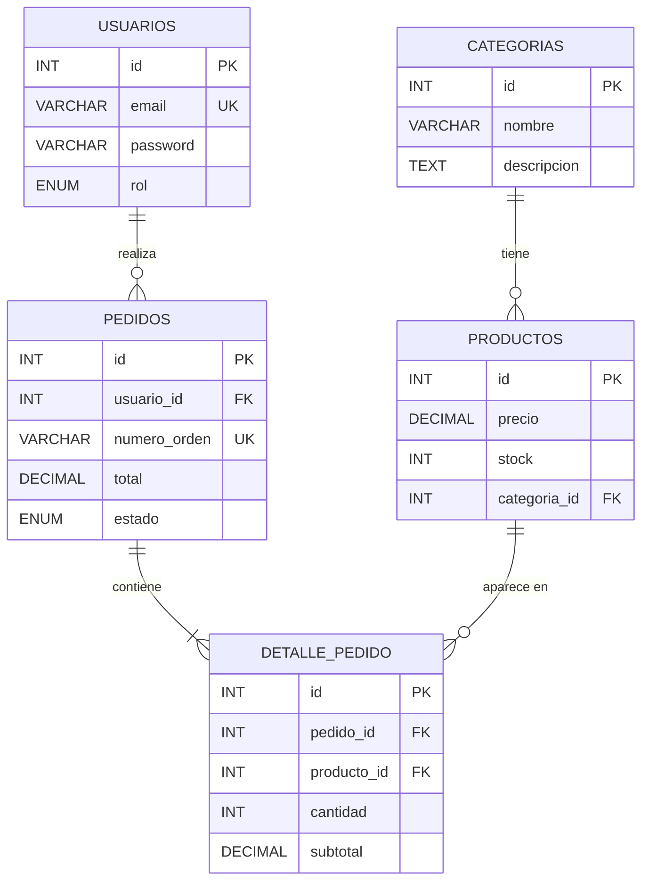

# 🛒 TiendaOnline — Plataforma E-Commerce

Plataforma de comercio electrónico completa desarrollada desde cero con **Python (Flask)**, **MySQL**, **HTML/CSS/JavaScript** y **Bootstrap 5**.

---

## 📋 Tabla de Contenidos

- [Descripción](#descripción)
- [Tecnologías](#tecnologías)
- [Arquitectura del Proyecto](#arquitectura-del-proyecto)
- [Requisitos Previos](#requisitos-previos)
- [Instalación y Ejecución](#instalación-y-ejecución)
- [Credenciales de Prueba](#credenciales-de-prueba)
- [Funcionalidades](#funcionalidades)
- [Funcionalidades Avanzadas](#funcionalidades-avanzadas)
- [Estructura de Archivos](#estructura-de-archivos)
- [Base de Datos](#base-de-datos)
- [Capturas de Pantalla](#capturas-de-pantalla)

---

## 📝 Descripción

TiendaOnline es una plataforma de e-commerce completamente funcional que permite a los usuarios navegar productos, agregar al carrito, realizar compras con simulación de pago, y consultar su historial de pedidos. Incluye un panel de administración completo para gestionar productos, pedidos y ver estadísticas de ventas.

---

## 🛠️ Tecnologías

| Tecnología | Uso |
|------------|-----|
| **HTML5** | Estructura de las páginas |
| **CSS3** | Estilos personalizados con tema oscuro |
| **JavaScript (ES6+)** | Validaciones, AJAX, interactividad |
| **Bootstrap 5.3** | Framework CSS para diseño responsivo |
| **Python 3.11** | Backend del servidor |
| **Flask 3.0** | Framework web (micro-framework) |
| **MySQL 8.0** | Base de datos relacional |
| **Docker & Docker Compose** | Contenerización y orquestación |
| **bcrypt** | Encriptación de contraseñas |

---

## 🏗️ Arquitectura del Proyecto



---

## ✅ Requisitos Previos

- **Docker** (versión 20.10+)
- **Docker Compose** (versión 2.0+)

> No se necesita instalar Python, MySQL, ni ninguna dependencia adicional. Docker se encarga de todo.

---

## 🚀 Instalación y Ejecución

### 1. Clonar o descargar el proyecto

```bash
cd /ruta/al/proyecto/E-Commerce
```

### 2. Levantar los contenedores

```bash
docker-compose up --build -d
```

### 3. Acceder a la aplicación

Abrir en el navegador: **http://localhost:5000**

### 4. Detener los contenedores

```bash
docker-compose down
```

### 5. Detener y eliminar todos los datos

```bash
docker-compose down -v
```

---

## 🔑 Credenciales de Prueba

| Rol | Email | Contraseña |
|-----|-------|------------|
| **Administrador** | admin@tienda.com | admin123 |
| **Cliente** | (registrarse) | (libre) |

---

## ⚡ Funcionalidades

### Front-End
- ✅ Página de inicio dinámica con productos destacados
- ✅ Catálogo de productos obtenido desde base de datos
- ✅ Buscador funcional por nombre o categoría
- ✅ Carrito de compras funcional (con sesión)
- ✅ Vista detallada de producto con productos relacionados
- ✅ Diseño responsivo (Bootstrap 5)
- ✅ Validaciones con JavaScript en todos los formularios

### Back-End
- ✅ Sistema de registro de usuarios
- ✅ Inicio y cierre de sesión
- ✅ Encriptación de contraseñas (bcrypt)
- ✅ Gestión de sesiones
- ✅ Panel administrador protegido
- ✅ CRUD completo de productos (Crear, Leer, Actualizar, Eliminar)
- ✅ Gestión de pedidos
- ✅ Confirmación de compra
- ✅ Generación automática de número de orden

### Base de Datos (MySQL)
- ✅ Tabla `usuarios`
- ✅ Tabla `productos`
- ✅ Tabla `categorias`
- ✅ Tabla `pedidos`
- ✅ Tabla `detalle_pedido`
- ✅ Script SQL exportado (`database/schema.sql`)

---

## 🔒 Funcionalidades Avanzadas (9 de 9)

| # | Funcionalidad | Implementación |
|---|---------------|----------------|
| 1 | **Filtro por rango de precio** | Slider doble en el catálogo (min/max) |
| 2 | **Validación anti-SQL Injection** | Todas las consultas usan parámetros `%s` |
| 3 | **Consultas preparadas** | `mysql-connector-python` con placeholders |
| 4 | **Roles (admin/cliente)** | Columna `rol` + decorador `@admin_requerido` |
| 5 | **Simulación pasarela de pago** | Formulario de tarjeta con validación visual |
| 6 | **Historial de compras** | Ruta `/mis-pedidos` con detalle completo |
| 7 | **Sistema de stock automático** | Stock se descuenta al pagar, se valida al agregar |
| 8 | **Panel de estadísticas** | Dashboard admin con ventas, top productos, gráficas |
| 9 | **AJAX carrito** | `fetch()` para agregar/actualizar/eliminar sin recargar |

---

## 📁 Estructura de Archivos

```
E-Commerce/
├── docker-compose.yml          # Orquestación de servicios
├── Dockerfile                  # Imagen del servidor web
├── .env                        # Variables de entorno
├── README.md                   # Este archivo
│
├── database/
│   └── schema.sql              # Script SQL completo de la base de datos
│
├── app/
│   ├── app.py                  # Aplicación principal Flask
│   ├── config.py               # Configuración
│   ├── db.py                   # Conexión y consultas a MySQL
│   ├── requirements.txt        # Dependencias Python
│   │
│   ├── routes/                 # Rutas del backend (Blueprints)
│   │   ├── __init__.py
│   │   ├── auth.py             # Autenticación (login, registro, logout)
│   │   ├── productos.py        # Catálogo y detalle de productos
│   │   ├── carrito.py          # Carrito de compras (AJAX)
│   │   ├── pedidos.py          # Pedidos, checkout, pago
│   │   └── admin.py            # Panel de administración
│   │
│   ├── templates/              # Templates HTML (Jinja2)
│   │   ├── base.html           # Layout base
│   │   ├── inicio.html         # Página de inicio
│   │   ├── catalogo.html       # Catálogo con filtros
│   │   ├── producto.html       # Detalle de producto
│   │   ├── carrito.html        # Carrito de compras
│   │   ├── registro.html       # Registro de usuario
│   │   ├── login.html          # Inicio de sesión
│   │   ├── checkout.html       # Checkout
│   │   ├── pago.html           # Simulación de pago
│   │   ├── confirmacion.html   # Confirmación de compra
│   │   ├── mis_pedidos.html    # Historial de pedidos
│   │   ├── detalle_pedido.html # Detalle de pedido
│   │   ├── 404.html            # Página de error 404
│   │   ├── 500.html            # Página de error 500
│   │   │
│   │   └── admin/              # Templates del administrador
│   │       ├── panel.html      # Dashboard con estadísticas
│   │       ├── productos.html  # Gestión de productos
│   │       ├── producto_form.html # Formulario crear/editar
│   │       └── pedidos.html    # Gestión de pedidos
│   │
│   └── static/                 # Archivos estáticos
│       ├── css/
│       │   └── estilos.css     # Estilos personalizados
│       ├── js/
│       │   └── main.js         # JavaScript principal
│       └── uploads/            # Imágenes de productos
│
└── docs/                       # Documentación
    ├── manual_tecnico.md       # Manual técnico
    ├── manual_usuario.md       # Manual de usuario
    ├── diagrama_er.md          # Diagrama entidad-relación
    └── diagrama_flujo.md       # Diagrama de flujo de compra
```

---

## 🗄️ Base de Datos

### Diagrama Entidad-Relación



---

## 👨‍💻 Autor

Proyecto desarrollado como proyecto académico de comercio electrónico.

---

## 📄 Licencia

Este proyecto es de uso académico.
