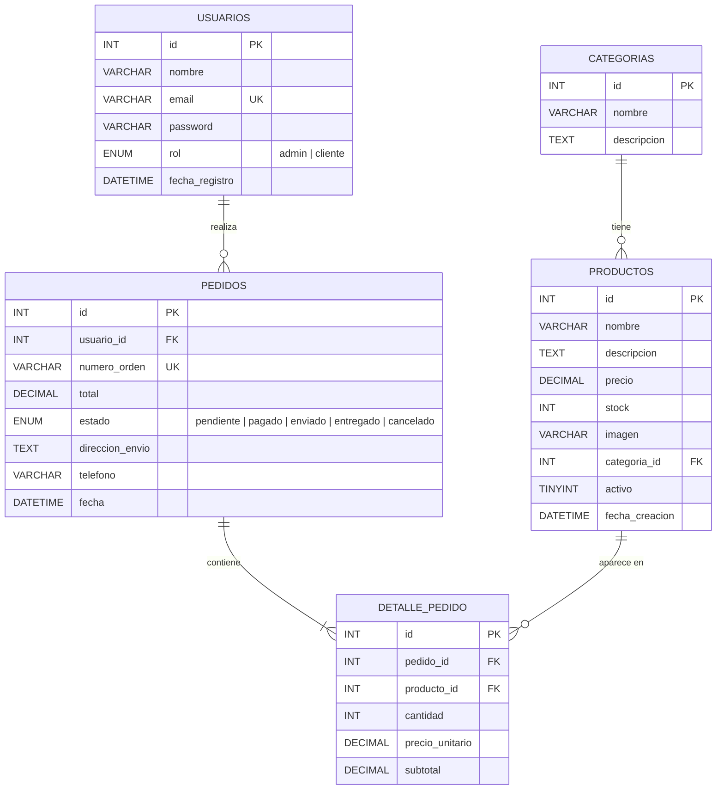
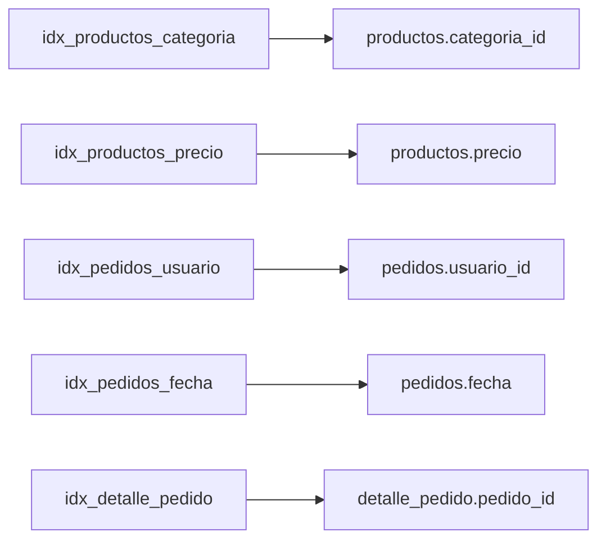
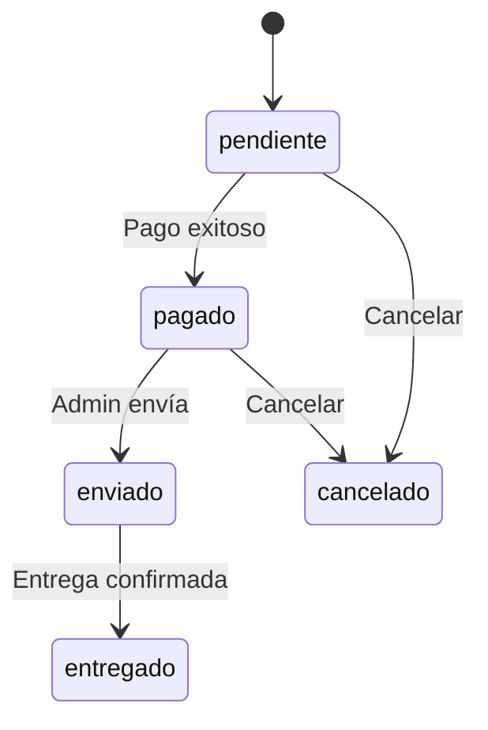

# 📊 Diagrama Entidad-Relación — TiendaOnline

## Diagrama ER

## Relaciones

| Relación | Tipo | Descripción | Regla de Eliminación |
|----------|------|-------------|---------------------|
| categorias → productos | 1:N | Una categoría tiene muchos productos | ON DELETE SET NULL |
| usuarios → pedidos | 1:N | Un usuario tiene muchos pedidos | ON DELETE CASCADE |
| pedidos → detalle_pedido | 1:N | Un pedido tiene muchas líneas de detalle | ON DELETE CASCADE |
| productos → detalle_pedido | 1:N | Un producto aparece en muchos detalles | ON DELETE CASCADE |

## Índices

## Estados de Pedido

## Roles de Usuario

| Rol | Acceso |
|-----|--------|
| `cliente` | Catálogo, carrito, compras, historial |
| `admin` | Todo lo anterior + panel de administración |
