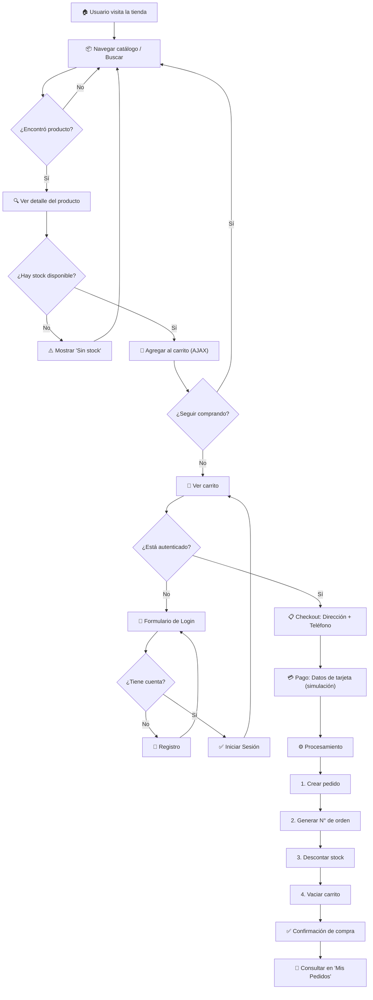
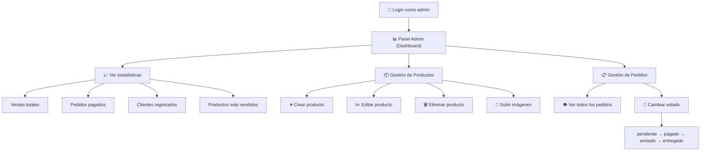
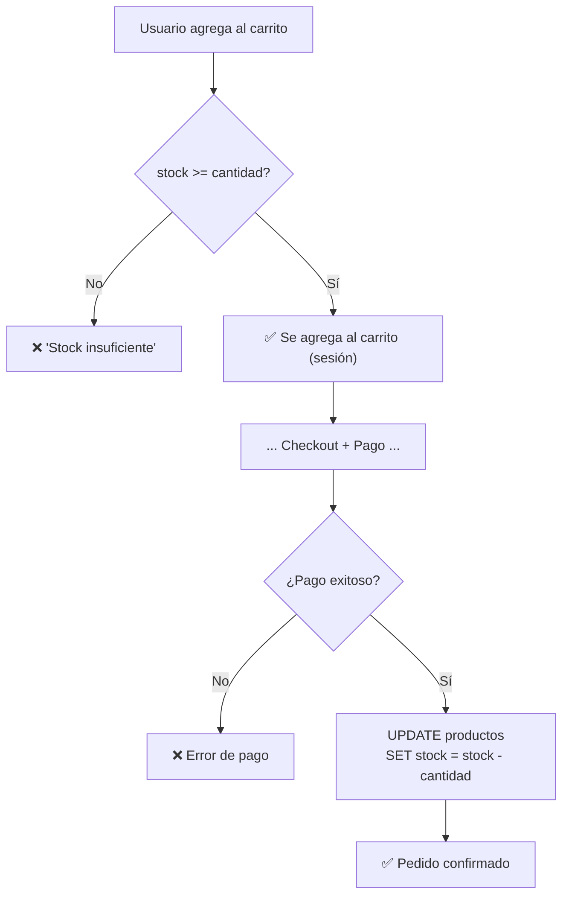
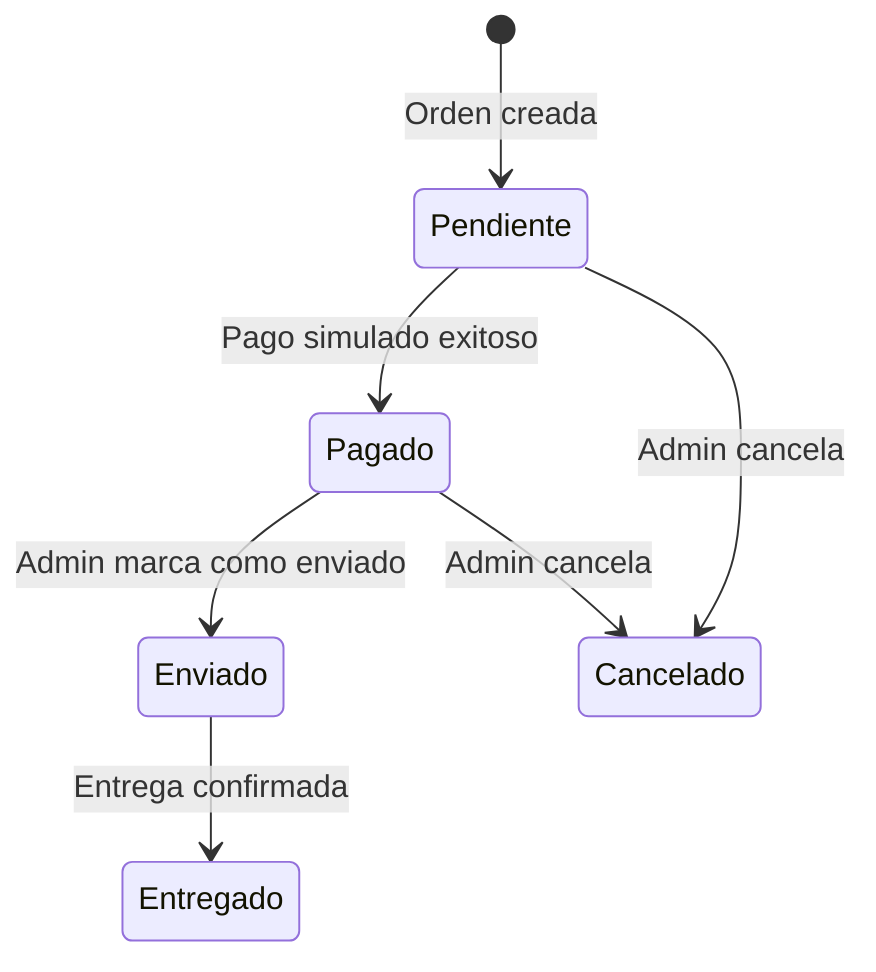

# 🔄 Diagrama de Flujo de Compra — TiendaOnline

## Flujo Principal de Compra

```mermaid
flowchart TD
    A["🏠 Usuario visita la tienda"] --> B["📦 Navegar catálogo / Buscar"]
    B --> C{"¿Encontró producto?"}
    C -- No --> B
    C -- Sí --> D["🔍 Ver detalle del producto"]
    D --> E{"¿Hay stock disponible?"}
    E -- No --> F["⚠️ Mostrar 'Sin stock'"]
    F --> B
    E -- Sí --> G["🛒 Agregar al carrito (AJAX)"]
    G --> H{"¿Seguir comprando?"}
    H -- Sí --> B
    H -- No --> I["🛒 Ver carrito"]
    I --> J{"¿Está autenticado?"}
    J -- No --> K["🔐 Formulario de Login"]
    K --> L{"¿Tiene cuenta?"}
    L -- No --> M["📝 Registro"]
    M --> K
    L -- Sí --> N["✅ Iniciar Sesión"]
    N --> I
    J -- Sí --> O["📋 Checkout: Dirección + Teléfono"]
    O --> P["💳 Pago: Datos de tarjeta (simulación)"]
    P --> Q["⚙️ Procesamiento"]
    Q --> R["1. Crear pedido"]
    R --> S["2. Generar N° de orden"]
    S --> T["3. Descontar stock"]
    T --> U["4. Vaciar carrito"]
    U --> V["✅ Confirmación de compra"]
    V --> W["📜 Consultar en 'Mis Pedidos'"]
```

## Flujo del Administrador

```mermaid
flowchart TD
    A["🔐 Login como admin"] --> B["📊 Panel Admin (Dashboard)"]
    B --> C["📈 Ver estadísticas"]
    C --> C1["Ventas totales"]
    C --> C2["Pedidos pagados"]
    C --> C3["Clientes registrados"]
    C --> C4["Productos más vendidos"]

    B --> D["📦 Gestión de Productos"]
    D --> D1["➕ Crear producto"]
    D --> D2["✏️ Editar producto"]
    D --> D3["🗑️ Eliminar producto"]
    D --> D4["📸 Subir imágenes"]

    B --> E["📋 Gestión de Pedidos"]
    E --> E1["👁️ Ver todos los pedidos"]
    E --> E2["🔄 Cambiar estado"]
    E2 --> E3["pendiente → pagado → enviado → entregado"]
```

## Gestión de Stock

```mermaid
flowchart TD
    A["Usuario agrega al carrito"] --> B{"stock >= cantidad?"}
    B -- No --> C["❌ 'Stock insuficiente'"]
    B -- Sí --> D["✅ Se agrega al carrito (sesión)"]
    D --> E["... Checkout + Pago ..."]
    E --> F{"¿Pago exitoso?"}
    F -- No --> G["❌ Error de pago"]
    F -- Sí --> H["UPDATE productos\nSET stock = stock - cantidad"]
    H --> I["✅ Pedido confirmado"]
```

## Ciclo de Vida de un Pedido

```mermaid
stateDiagram-v2
    [*] --> Pendiente : Orden creada
    Pendiente --> Pagado : Pago simulado exitoso
    Pagado --> Enviado : Admin marca como enviado
    Enviado --> Entregado : Entrega confirmada
    Pendiente --> Cancelado : Admin cancela
    Pagado --> Cancelado : Admin cancela
```
