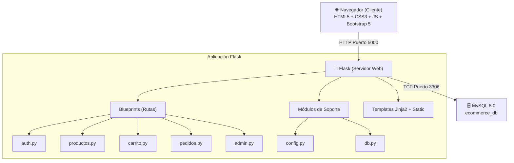

# 📘 Manual Técnico — TiendaOnline

## 1. Introducción

Este documento describe la arquitectura, tecnologías, configuración y estructura técnica de la plataforma de comercio electrónico **TiendaOnline**.

---

## 2. Tecnologías Utilizadas

| Componente | Tecnología | Versión |
|------------|-----------|---------|
| **Lenguaje Backend** | Python | 3.11 |
| **Framework Web** | Flask | 3.0+ |
| **Base de Datos** | MySQL | 8.0 |
| **Conector BD** | mysql-connector-python | 9.1+ |
| **Encriptación** | bcrypt | 4.2+ |
| **Frontend** | HTML5, CSS3, JavaScript ES6+ | — |
| **Framework CSS** | Bootstrap | 5.3 |
| **Contenerización** | Docker + Docker Compose | 20.10+ / 2.0+ |

---

## 3. Arquitectura del Sistema

### 3.1 Patrón de Diseño

La aplicación sigue el patrón **MVC (Modelo-Vista-Controlador)** adaptado a Flask:

- **Modelo**: Consultas SQL en `db.py` con prepared statements
- **Vista**: Templates Jinja2 en `templates/`
- **Controlador**: Blueprints en `routes/`

### 3.2 Diagrama de Componentes



---

## 4. Estructura del Proyecto

```
E-Commerce/
├── docker-compose.yml       # Orquestación de contenedores
├── Dockerfile               # Imagen del servidor Flask
├── .env                     # Variables de entorno
├── README.md
├── database/
│   └── schema.sql           # DDL + datos iniciales
├── app/
│   ├── app.py               # Punto de entrada Flask
│   ├── config.py            # Configuración centralizada
│   ├── db.py                # Helper de base de datos
│   ├── requirements.txt     # Dependencias Python
│   ├── routes/              # Controladores (Blueprints)
│   ├── templates/           # Vistas HTML (Jinja2)
│   └── static/              # CSS, JS, uploads
└── docs/                    # Documentación
```

---

## 5. Base de Datos

### 5.1 Motor y Configuración

- **Motor**: InnoDB (soporte de transacciones y FK)
- **Charset**: utf8mb4 (soporte completo Unicode/emojis)
- **Collation**: utf8mb4_unicode_ci

### 5.2 Tablas

| Tabla | Descripción | Campos Clave |
|-------|-------------|--------------|
| `usuarios` | Usuarios del sistema | `id`, `email` (UNIQUE), `password` (bcrypt), `rol` |
| `categorias` | Categorías de productos | `id`, `nombre`, `descripcion` |
| `productos` | Inventario de la tienda | `id`, `nombre`, `precio`, `stock`, `imagen`, `activo` |
| `pedidos` | Órdenes de compra | `id`, `numero_orden` (UNIQUE), `total`, `estado` |
| `detalle_pedido` | Líneas de cada pedido | `id`, `pedido_id` (FK), `producto_id` (FK), `cantidad` |

### 5.3 Relaciones

- `productos.categoria_id` → `categorias.id` (ON DELETE SET NULL)
- `pedidos.usuario_id` → `usuarios.id` (ON DELETE CASCADE)
- `detalle_pedido.pedido_id` → `pedidos.id` (ON DELETE CASCADE)
- `detalle_pedido.producto_id` → `productos.id` (ON DELETE CASCADE)

### 5.4 Índices

```sql
idx_productos_categoria  -- Búsqueda por categoría
idx_productos_precio     -- Filtro por rango de precio
idx_pedidos_usuario      -- Historial de pedidos por usuario
idx_pedidos_fecha        -- Ordenamiento por fecha
idx_detalle_pedido       -- Detalle por pedido
```

---

## 6. Seguridad

### 6.1 Contraseñas

Las contraseñas se encriptan con **bcrypt** (hashing con salt aleatorio):

```python
# Registro
password_hash = bcrypt.hashpw(password.encode('utf-8'), bcrypt.gensalt())

# Login - verificación
bcrypt.checkpw(password.encode('utf-8'), hash_almacenado.encode('utf-8'))
```

### 6.2 Prevención de SQL Injection

**Todas** las consultas usan **prepared statements** con placeholders `%s`:

```python
# ✅ CORRECTO - Consulta parametrizada
ejecutar_consulta(
    "SELECT * FROM productos WHERE nombre LIKE %s AND precio <= %s",
    (f"%{busqueda}%", precio_max)
)

# ❌ INCORRECTO - Nunca se usa concatenación de strings
# f"SELECT * FROM productos WHERE nombre LIKE '%{busqueda}%'"
```

### 6.3 Control de Acceso

- **Decorador `@login_requerido`**: Protege rutas que requieren autenticación
- **Decorador `@admin_requerido`**: Protege rutas del panel de administración
- **Sesiones**: Datos del usuario almacenados en sesión Flask con `secret_key`

### 6.4 Validación de Archivos

Las imágenes subidas se validan por extensión permitida (png, jpg, jpeg, gif, webp) y se renombran con UUID para prevenir conflictos.

---

## 7. API Endpoints

### 7.1 Rutas Públicas

| Método | Ruta | Descripción |
|--------|------|-------------|
| GET | `/` | Página de inicio |
| GET | `/catalogo` | Catálogo con filtros |
| GET | `/producto/<id>` | Detalle de producto |
| GET | `/registro` | Formulario de registro |
| POST | `/registro` | Procesar registro |
| GET | `/login` | Formulario de login |
| POST | `/login` | Procesar login |
| GET | `/logout` | Cerrar sesión |

### 7.2 Rutas del Carrito (AJAX)

| Método | Ruta | Descripción |
|--------|------|-------------|
| GET | `/carrito` | Ver carrito |
| POST | `/api/carrito/agregar` | Agregar producto (JSON) |
| POST | `/api/carrito/actualizar` | Actualizar cantidad (JSON) |
| POST | `/api/carrito/eliminar` | Eliminar del carrito (JSON) |

### 7.3 Rutas de Pedidos (Autenticado)

| Método | Ruta | Descripción |
|--------|------|-------------|
| GET/POST | `/checkout` | Proceso de checkout |
| GET/POST | `/pago/<orden>` | Simulación de pago |
| GET | `/confirmacion/<orden>` | Confirmación de compra |
| GET | `/mis-pedidos` | Historial de pedidos |
| GET | `/pedido/<id>` | Detalle de pedido |

### 7.4 Rutas de Admin (Solo admin)

| Método | Ruta | Descripción |
|--------|------|-------------|
| GET | `/admin/` | Dashboard estadísticas |
| GET | `/admin/productos` | Listar productos |
| GET/POST | `/admin/productos/crear` | Crear producto |
| GET/POST | `/admin/productos/editar/<id>` | Editar producto |
| POST | `/admin/productos/eliminar/<id>` | Eliminar producto |
| GET | `/admin/pedidos` | Listar pedidos |
| POST | `/admin/pedidos/<id>/actualizar` | Actualizar estado |

---

## 8. Configuración Docker

### 8.1 Servicios

| Servicio | Imagen | Puerto | Función |
|----------|--------|--------|---------|
| `db` | mysql:8.0 | 3306 (interno) | Base de datos |
| `web` | python:3.11-slim (custom) | 5000:5000 | Aplicación Flask |

### 8.2 Volúmenes

- `mysql_data`: Persistencia de datos MySQL
- `./database/schema.sql` → `/docker-entrypoint-initdb.d/`: Inicialización automática
- `./app/static/uploads` → `/app/static/uploads`: Imágenes de productos

### 8.3 Variables de Entorno (.env)

```
MYSQL_ROOT_PASSWORD=root_password_seguro
MYSQL_DATABASE=ecommerce_db
MYSQL_USER=ecommerce_user
MYSQL_PASSWORD=ecommerce_pass_seguro
FLASK_SECRET_KEY=clave_secreta_flask_muy_segura
FLASK_ENV=development
```

---

## 9. Despliegue

### Desarrollo

```bash
docker-compose up --build -d
# Acceder en http://localhost:5000
```

### Producción (recomendaciones)

1. Cambiar `FLASK_ENV=production` en `.env`
2. Usar contraseñas fuertes para MySQL
3. Agregar Nginx como reverse proxy
4. Configurar gunicorn en lugar de servidor Flask de desarrollo
5. Habilitar HTTPS con certificado SSL
